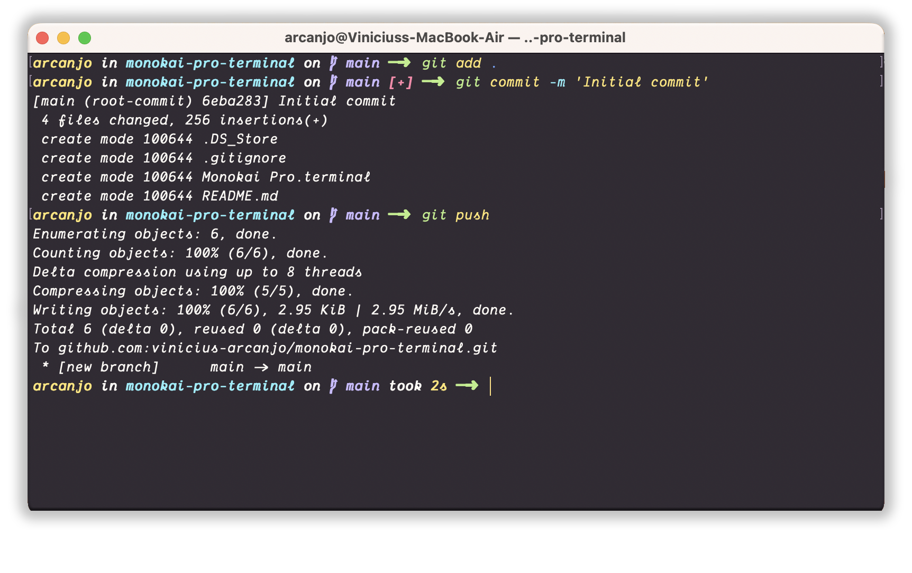

## Monokai Pro

Monokai Pro theme for macOS Terminal

# How to install
 - Terminal / Profiles Tab
 - Click _"Gear" icon_
 - Click _Import..._
 - Select the `Monokai Pro.terminal` file 
 - Click _Default_

